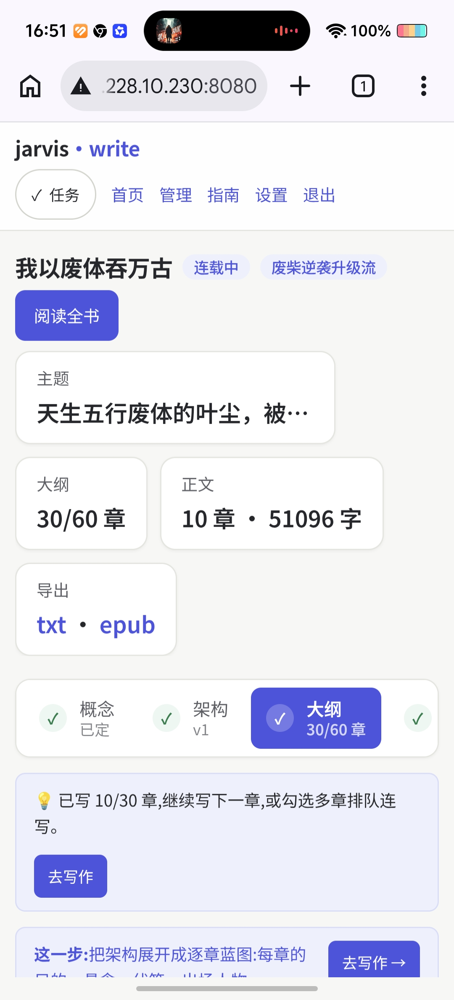
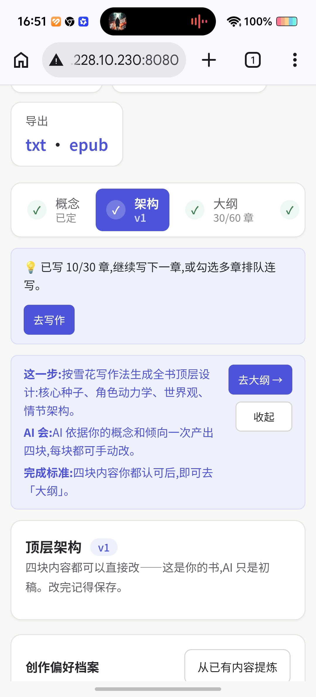

## 直击现场

写作以章节为中心：左侧章节轨管选章与状态，中间正文永远是视觉重心，右侧参考抽屉放蓝图/人物/伏笔/审核报告，底部动作条一键发起生成、重写、润色、校对、评分。

<p align="center">
  
</p>
<p align="center"><i>写作工作台（截图为早期版本，界面已按「以章节为中心」重构，持续迭代中）</i></p>

改大纲不再是大工程。改任意一章，系统自动分级改动、分析下游影响、勾选后级联重生成：

<p align="center">
  
</p>
<p align="center"><i>大纲级联更新全流程演示（30 秒）</i></p>

## 移动端

手机浏览器打开即用：进来就是当前章正文，底部栏 + 悬浮动作按钮，左右滑动切章，参考与结果以全屏面板弹出。

<div style="display:grid;grid-template-columns:repeat(3,1fr);gap:14px;max-width:600px;margin:16px 0;">
  
  
  
  
  
  
  
  
  
</div>
<p><i>移动端截图（界面持续迭代中）</i></p>

## 三种使用方式

**1. 桌面安装包（Windows，最简单）**

从 [GitHub Releases](https://github.com/ynnyh/jarvis-write/releases/latest) 下载 `jarvis-write_<版本>_x64-setup.exe`，双击安装即可。免登录单机运行，数据落本机，首次打开填上自己的 LLM API key 就能写。

**2. Docker 自部署（多用户服务）**

```bash
git clone https://github.com/ynnyh/jarvis-write.git
cd jarvis-write
docker compose up --build
```

访问 `http://localhost:8000`，JWT 登录 + 邀请码注册 + 每用户独立 LLM key + 数据隔离。配置项见 [backend/.env.example](https://github.com/ynnyh/jarvis-write/blob/main/backend/.env.example)。

**3. 不想部署，直接试用**

扫码进 QQ 群领**邀请码**，开箱即用：

<p>
  
</p>
<p><b>QQ 群：1006352530</b> · 扫码进群，领邀请码免费试用</p>

## 继续了解

- [功能导览](/features)——按真实功能逐条介绍：写作工作台、命令面板、一致性引擎、编辑部、去 AI 味、桌面端与移动端体验
- [00 · 项目愿景与调研对比](/00-overview)——为什么做、和同类项目差在哪
- [03 · 三大引擎设计](/03-engines)——一致性 / 大纲级联 / 润色 / 翻新的技术细节
- [07 · 交互重构：双端设计与实施规格](/07-交互重构-双端设计与实施规格)——三区信息架构、快捷键、桌面客户端与移动端设计
